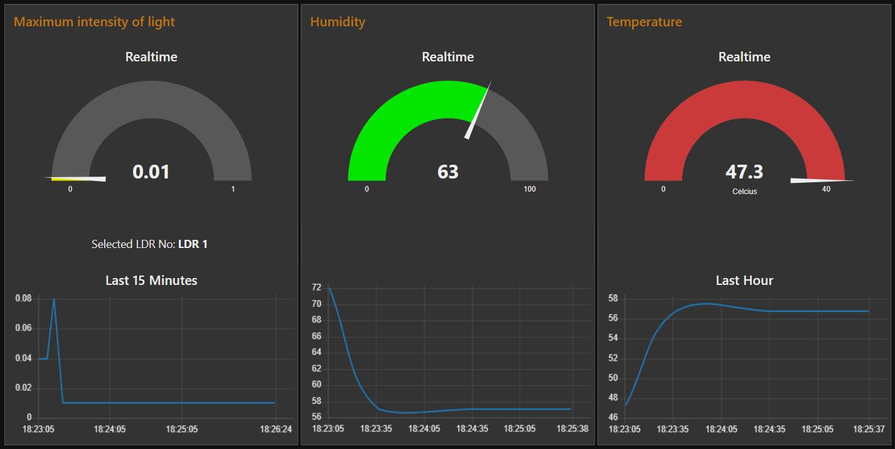

# Smart Medibox

Smart Medibox is a smart device designed to assist users in managing their medication effectively. It integrates several features to ensure medication adherence and proper storage conditions.

## Features

1. **Medication Reminders**: The device reminds users to take their medication at specified times through alarms.

2. **Temperature and Humidity Monitoring**: Continuous monitoring of temperature and humidity inside the Medibox ensures that medications are stored under optimal conditions. Users are notified if conditions deviate from the desired range.

3. **Light Control**: A motorized curtain controls the amount of light entering the Medibox, helping to maintain the appropriate environment for medication storage.


## Technologies and Components

### Components:
- ADAFRUIT SSD 1306 OLED Monochrome Display (128x64)
- ESP32 Devkit V1
- DHT11 Temperature and Humidity Sensor (Configurable for DHT22)
- SG90 Micro Server Motor
- LDRs and 10kΩ Resistors
- Push Buttons

### Notes:
- The project is developed using the specified components. If components are changed, parameters may need adjustment accordingly.

## Usage

To use the Smart Medibox:

1. Connect the specified components according to the provided instructions.
2. Upload the provided code to the ESP32 Devkit V1.
3. Configure medication reminders, temperature/humidity thresholds, and light control preferences as needed.
4. Place medications inside the Medibox and close the lid.
5. The device will handle reminders, monitor conditions, and control the light automatically.

# Getting Started

## Prerequisites
- Git
- PlatformIO with Arduino Framework Set up
- Relevant hardware for testing if you are not intending to use simulations
- Node-RED Installed Environment and an MQTT Broker (Both optional)

## Medibox Setup

1. Clone the repository:
    ```bash 
    git clone https://github.com/eshansurendra/Smart-MediBox    
    ```

    > [!IMPORTANT]
    > If you intend to simulate the project using the Wokwi extension, clone the relevant branch using:
    > ```bash 
    > git clone -b Wokwi-Simulation https://github.com/eshansurendra/Smart-MediBox    
    > ```

2. PlatformIO typically installs required libraries automatically. If not, install them referring to the `configuration.ini` file displayed above.

3. Compile and Upload/Simulate.

## Node-RED Dashboard



1. After completing the above steps, all basic and major functionalities will work, except for the Node-RED based functionalities. Follow these instructions to deploy an instance of the Node-RED Dashboard:

2. Import the `./Node-Red Flow/flows.json` to the Node-RED canvas.

3. Set up required parameters of the flows including the MQTT server and then deploy. (This is defaulted to the Mosquitto testing server.)


# About

This project was first developed as the Semester 4 Project in the Module `EN2853 - Embedded Systems & Applications`

## Contributing

Contributions are welcome! 

- **Bug Fixes:** If you find any bugs or issues, feel free to create an issue or submit a pull request.
- **Feature Enhancements:** If you have ideas for new features or improvements, don't hesitate to share them.

# License

This project is licensed under the [MIT License](LICENSE).

[go to the top](#Smart-Medibox)
